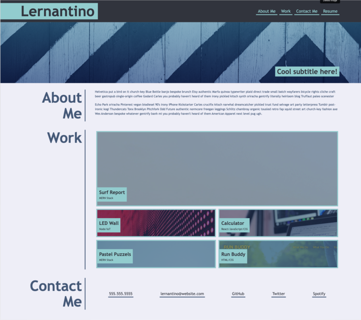
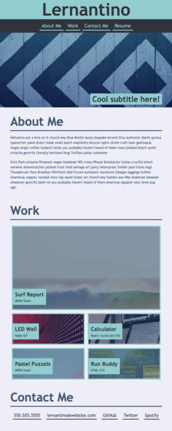
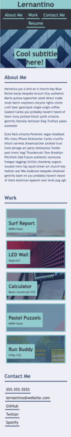

# Portfolio
A portfolio of work created by Vicki Dunlop. This portfolio contains samples of web programming code completed by Vicki Dunlop for your review.

## Description
This portfolio contains current samples of the most current web programming projects that were created by Vicki Dunlop. 

Programming languages highlighted are:

     HTML
     CSS
     JavaScript
     Node
     SQL
     MongoDB
     React
     C and C++
     Tableau

It will be accessible via many devices including cell phones, tablets and laptops.

Archived projects will be available to provide a deeper understanding of the programming projects that Vicki has accomplished to make her a well-rounded programmer.

## User Story
AS AN employer

I WANT to view a potential employee's deployed portfolio of work samples

SO THAT I can review samples of their work and assess whether they're a good candidate for an open position

### Acceptance Criteria
GIVEN I need to sample a potential employee's previous work

WHEN I load their portfolio

THEN I am presented with the developer's name, a recent photo or avatar, and links to sections about them, their work, and how to contact them

WHEN I click one of the links in the navigation

THEN the UI scrolls to the corresponding section

WHEN I click on the link to the section about their work

THEN the UI scrolls to a section with titled images of the developer's applications

WHEN I am presented with the developer's first application

THEN that application's image should be larger in size than the others

WHEN I click on the images of the applications

THEN I am taken to that deployed application

WHEN I resize the page or view the site on various screens and devices

THEN I am presented with a responsive layout that adapts to my viewport

### Mock Up
Screenshot of the website in 3 screen sizes. 

## Installation/Execution
https://vdunlop.github.io/portfolio/

There are 4 navigation items in the website's header. When they are selected, the website should respond as follows:

About Me - your view will move to the section titled About Me

Work - your view will move to the section titled Work

Contact Me - your view will move to the section titled Contact Me

Resume - you will be brought to a .pdf version of my resume

Each image links to a project in the specified language listed.

Contact information for Vicki is included at the bottom of this Portfolio.

## Usage
When you open the portfolio window, you will be able to navigate to the sections below the main image by selecting the navigation items at the top of the page.

You will be able to view Vicki's current resume, as well as her LinkedIn page. 

Vicki's most current projects are highlighted first. Click on the image.

Archived projects are listed below the current project images.

Vicki's most current contact information is at the bottom of the screen.

## Credits

N/A

## License

N/A
